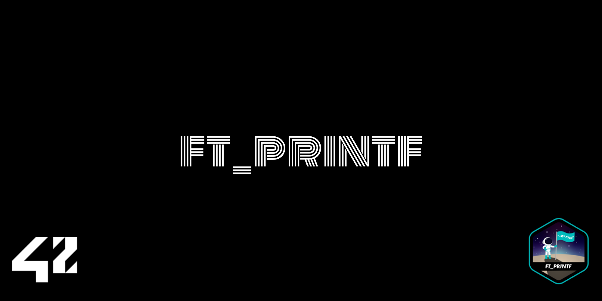

*This project has been created as part
of the 42 curriculum by vigomes-*

# ft_printf (because ft_putnbr() and ft_putstr() aren’t enough)

<!-- Description -->
## DESCRIPTION
`ft_printf` is a custom implementation of the standard C `printf` function. This project focus on variadic functions, format string parsing, data conversions, and low-level output headling using as based function the `write` system call. I had to handle formated string with the standard `%cspdiuxX%` specifiers.

For this project, I was allowed to you variadic functions (`va_list`, `va_start`, `va_arg` and `va_end`) and my `libft` (in which i implemented `ft_putstr`, `ft_putchar`, `ft_puthexdec`, and `ft_uitoa`)


### Project structure
```txt
printf/
├─ includes/
│  └─ libft/
├─ ft_printf_utils1.c
├─ ft_printf_utils2.c
├─ ft_printf_validations.c
├─ ft_printf.c
├─ ft_printf.h
├─ Makefile
 └─ README.md
```

## INTRODUCTION | How to use
<!-- Instructions -->
<!-- An “Instructions” section containing any relevant information about compilation, installation, and/or execution. -->

### Option 1:
#### 1.1 - setting environment
> copy the ft_printf directory to the directory `includes` inside of your project
```bash
cp -r [ft_printf directory path] [your project directory path]/includes
```
#### 1.2 - compilation setting
##### 1.2.1 add libft on your project Makefile definition
```Makefile
FT_PRINTF_DIR	=	includes/ft_printf/
FT_PRINTF		=	$(FT_PRINTF_DIR)libftprintf.a
FT_PRINTF_OBJ	=	$(wildcard $(FT_PRINTF_DIR)*.o)
```
##### 1.2.2 include libft on your project Makefile compilations rules — usually after all: $(NAME)
```Makefile
all: $(NAME)
$(FT_PRINTF):
	$(MAKE) -C $(FT_PRINTF_DIR)


$(NAME): $(OBJS) $(FT_PRINTF)
		$(COMPILER) $(COMPILER_FLAGS) $(OBJS) $(FT_PRINTF) -o $(NAME)
```
##### 1.2.3 include libft on your project Makefile fclean rule
```Makefile
fclean: clean
		@make fclean -C $(FT_PRINTF_DIR)
```
#### 1.3 - using ft_printf on your project
##### 1.3.option_1
> Option 1: add ft_printf on your project header file — usually on `includes/your_project.h`
```c
#ifndef YOUR_PROJECT_H
# define YOUR_PROJECT_H

# include "ft_printf.h"

#endif
```
> then call your project header on your file `.c`
```c
#include "../includes/your_project.h"
```
##### 1.3.option_2
```c
#include "../includes/ft_printf/ft_printf.h"
```

### Option 2:
#### 2.1 - Run `make` command at project root
```bash
make
```
#### 2.2 - create test file
```bash
make test
```

#### 2.3 - run it
```bash
./a.out
```
> try flags `--b`, `--t`, `--g` or `--a`

## ALGORITHMS AND DATA STRUCT CHOISES
<!-- Algorithms selection explanation and justification -->
The first thing my ft_printf does is to validate the string, passing throughout it to check if it exist (is not a NULL string) and if it has only valid indentifiers. This way, I can just print the formated string (with its arguments) safely. I didn't used structs and linked list because i did't see them necessary on this project.


## RESOURCES
<!-- Resources -->
[`Acelera 42`](https://rodsmade.notion.site/Acelera-Printf-9b57272e356c45968455fe31b47952fc) 
| [`Miro`](https://miro.com/app/board/o9J_lvIlG4Q=/?invite_link_id=820324963059) | [`YouTube - What are variadic functions (va_list) in C?`](https://www.youtube.com/watch?v=oDC208zvsdg) | [`variadic functions documentations`](https://learn.microsoft.com/en-us/cpp/c-runtime-library/reference/va-arg-va-copy-va-end-va-start?view=msvc-160) | [`ASCII Chart - cppreference`](https://en.cppreference.com/c/language/ascii) | [`AI`](https://chatgpt.com/)

### AI prompts
#### Prompt used to ...
```txt
How does va_arg, va_list, va_start and va_end works?

What does va_arg return if I ask for a int and the next argument at va_list is a string?
```
